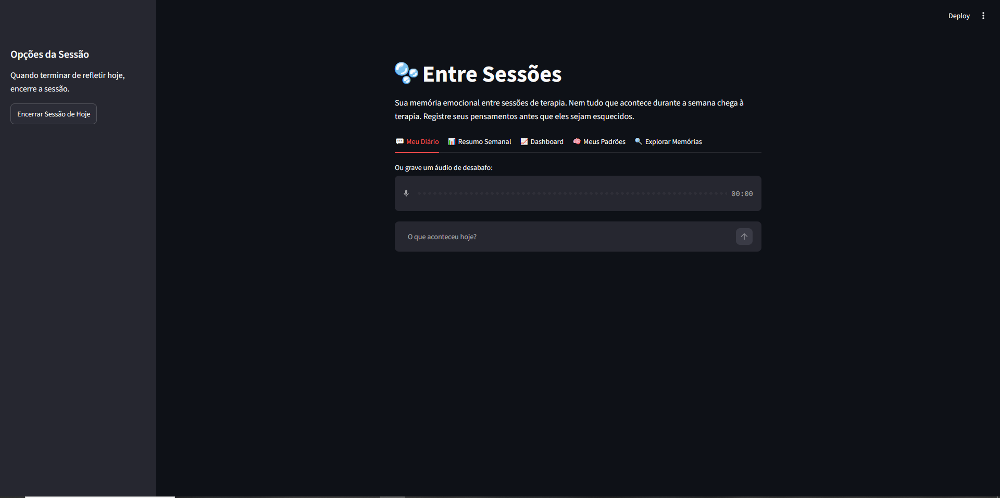
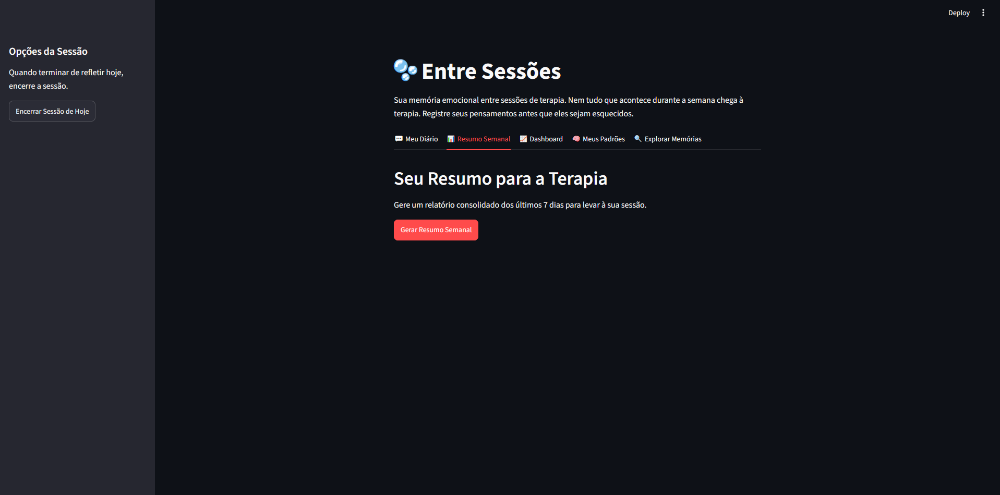
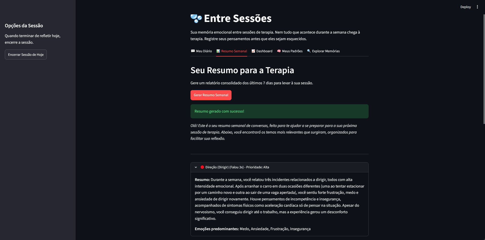
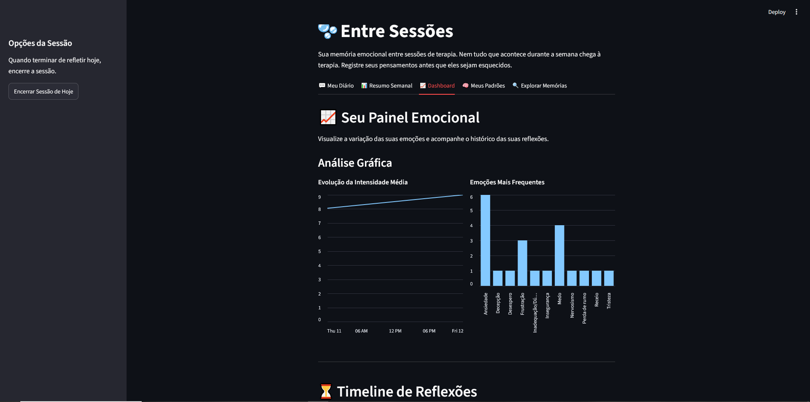
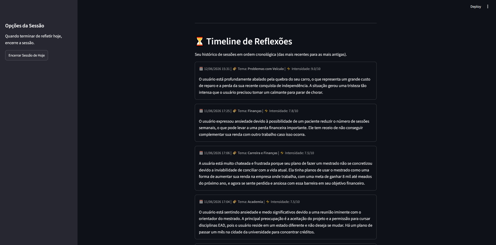
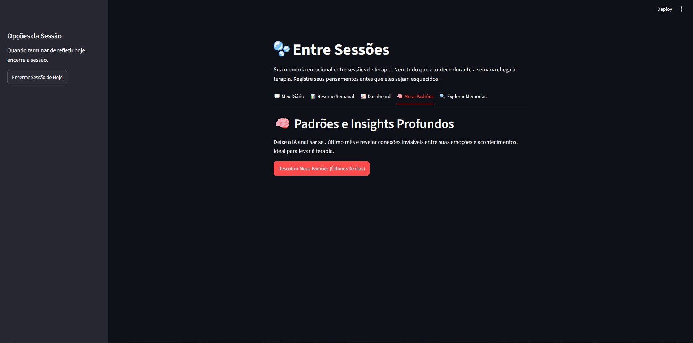
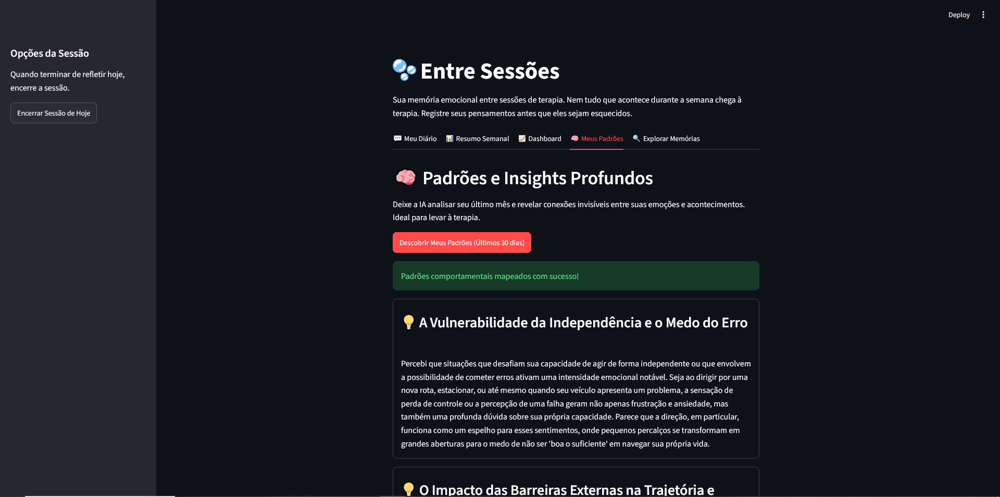
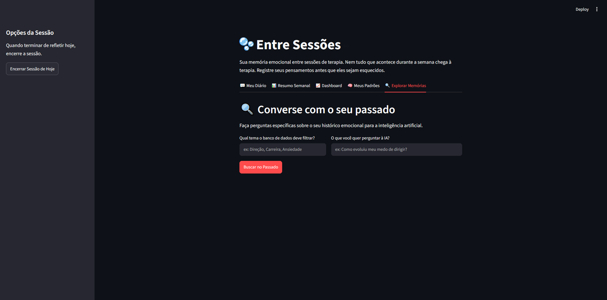
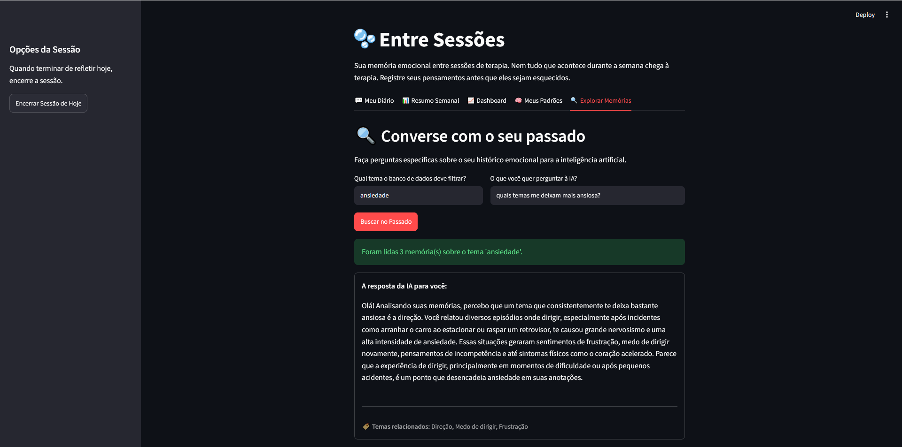

# 🫧 Entre Sessões

> **Sua memória emocional entre sessões de terapia.**


O **Entre Sessões** é uma aplicação de Inteligência Artificial desenvolvida para registrar pensamentos, emoções e acontecimentos importantes do dia a dia, transformando conversas em uma memória emocional pesquisável.

O objetivo do projeto é ajudar o usuário a organizar aquilo que vive entre uma sessão de terapia e outra, gerando resumos, identificando padrões e facilitando o processo de autoconhecimento.

> **Este projeto não substitui terapia, acompanhamento psicológico ou psiquiátrico, nem realiza diagnósticos clínicos.**

---

# ✨ Motivação

Muitas pessoas chegam à terapia dizendo:

> *"Minha semana foi normal... nem lembro direito do que aconteceu."*

Entretanto, durante os dias anteriores viveram conflitos, medos, conquistas, inseguranças e reflexões importantes que acabam sendo esquecidos.

O **Entre Sessões** nasceu para funcionar como uma **memória emocional inteligente**, registrando essas experiências e organizando-as para que possam ser revisitadas posteriormente.

---

# 🚀 Funcionalidades

* 💬 Diário conversacional com IA
* 🎤 Registro por áudio utilizando Whisper
* 🧠 Análise automática de emoções
* 📊 Dashboard emocional
* 📅 Timeline cronológica de reflexões
* 📄 Resumo semanal para terapia
* 🧩 Descoberta automática de padrões emocionais
* 🔍 Busca semântica por tema e período

---

# 📱 Demonstração

## Tela Inicial


---

## 📄 Resumo para Terapia




---

## 📊 Dashboard Emocional



---

## ⏳ Meus Padrões



---

## 🔍 Explorar Memórias



---

# 🏗️ Arquitetura

```text
                    Usuário
                       │
                       ▼
             Conversation Agent
                       │
                       ▼
               Analysis Agent
                       │
        ┌──────────────┼──────────────┐
        ▼              ▼              ▼
 PostgreSQL      Emotional Analysis   Embeddings
        │
        ├────────► Timeline
        ├────────► Dashboard
        ├────────► Resumos Semanais
        ├────────► Busca Semântica
        └────────► Insights
```
A documentação completa da arquitetura pode ser encontrada em:

- 📄 `docs/Projeto_Entre_Sessoes_Arquitetura.docx`
---

# 🧠 Tecnologias

* Python
* Streamlit
* PostgreSQL
* SQLAlchemy
* Google Gemini
* Whisper
* Embeddings
* Inteligência Artificial Generativa
* NLP (Natural Language Processing)

---

# 🎯 Objetivo do Projeto

O objetivo do Entre Sessões é transformar conversas cotidianas em conhecimento estruturado sobre a própria história emocional, permitindo que o usuário:

* compreenda padrões recorrentes;
* acompanhe sua evolução ao longo do tempo;
* registre acontecimentos importantes;
* preserve memórias emocionais;
* leve informações relevantes para suas sessões de terapia.

---

# 🔍 Busca Semântica

O sistema permite consultar o histórico emocional utilizando linguagem natural.

Exemplos:

* "Como evoluiu meu medo de dirigir?"
* "Resuma tudo sobre trabalho nos últimos três meses."
* "Quando comecei a falar sobre ansiedade?"
* "Mostre tudo relacionado à minha família."

---

# 📈 Roadmap

## ✅ Implementado

* Diário conversacional
* Persistência em PostgreSQL
* Analysis Agent
* Histórico de conversas
* Resumo semanal
* Dashboard emocional
* Timeline de reflexões
* Insights automáticos
* Busca semântica
* Áudio (Whisper)

---

## 🚧 Próximas versões

* 📱 Aplicativo mobile
* ⭐ Memórias favoritas
* 📤 Exportação em PDF para terapia
* 🔔 Lembretes inteligentes
* 📆 Calendário emocional aprimorado

---

# ⚠️ Aviso

Este projeto possui finalidade exclusivamente educacional e de apoio ao autoconhecimento.

O Entre Sessões **não realiza diagnóstico, intervenção clínica ou substitui acompanhamento psicológico ou psiquiátrico**. Em situações de sofrimento intenso ou emergência, deve-se buscar atendimento profissional adequado.

---

# 👩‍💻 Sobre o Projeto

O Entre Sessões foi desenvolvido como um projeto de estudo em **IA Aplicada**, unindo agentes conversacionais, análise emocional, memória de longo prazo, busca semântica e geração automática de resumos para explorar o potencial da Inteligência Artificial como ferramenta de apoio ao autoconhecimento.

---

## 🌱 Filosofia do Projeto

> **Nem tudo o que sentimos chega à terapia.**
>
> **Entre Sessões ajuda você a lembrar, organizar e compreender sua própria jornada emocional.**
